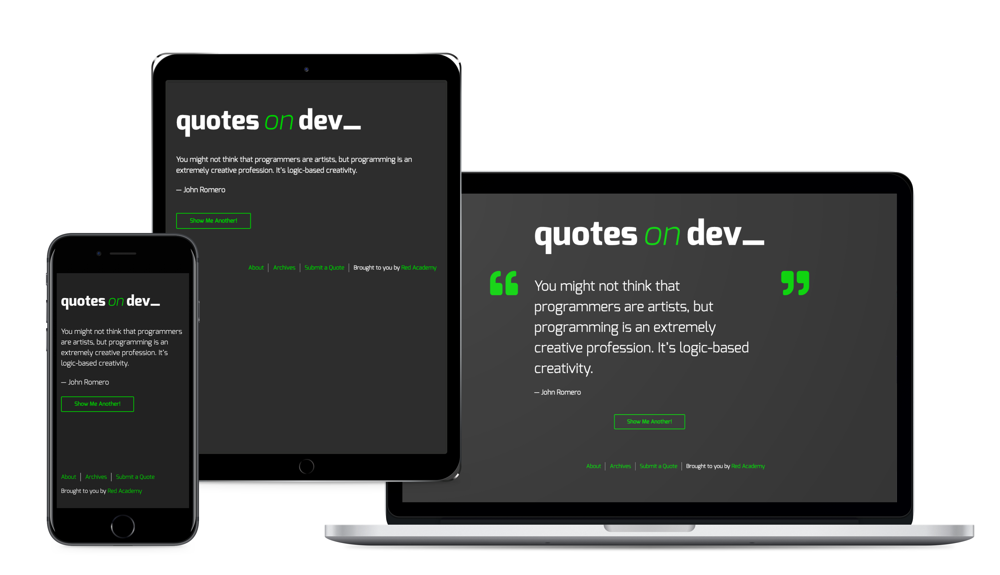
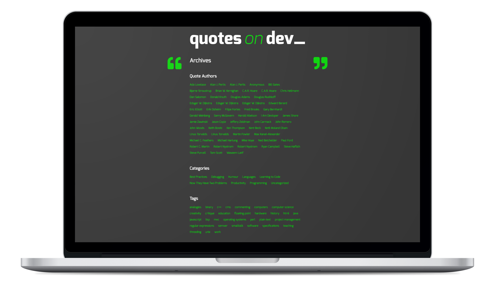
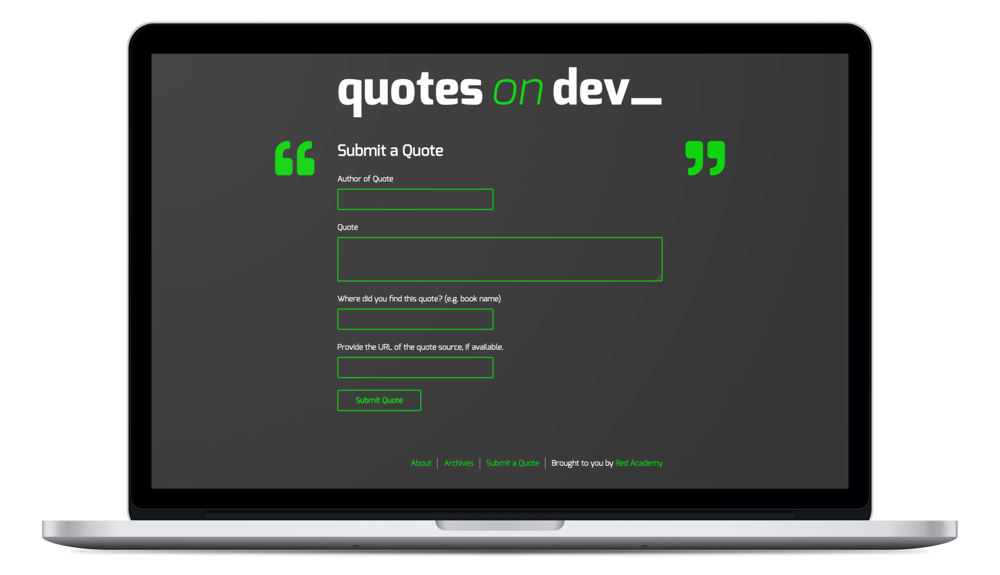
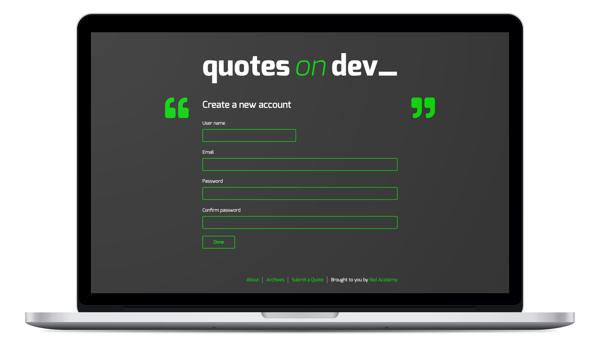

# Quotes on Dev Starter

A WordPress starter theme for the Quotes on Dev project, forked from [Underscores (https://underscores.me/)](https://underscores.me/)





[](https://www.php.net/)
[](https://www.mysql.com/)
[](https://wordpress.org/)

[](https://github.com/gulpjs/gulp)
[](https://github.com/dlmanning/gulp-sass)
[](https://jquery.com/)


[](https://github.com/BrowserSync/browser-sync)
[](https://github.com/sindresorhus/gulp-autoprefixer)
[](https://github.com/ben-eb/gulp-cssnano)
[](https://github.com/adametry/gulp-eslint)
[](https://github.com/andidittrich/gulp-prettyerror)
[](https://github.com/hparra/gulp-rename)
[](https://github.com/duan602728596/gulp-terser)

[](https://github.com/CMB2/CMB2/)
[](https://wordpress.org/plugins/debug-bar/)
[](https://github.com/WP-API/Basic-Auth)
[](https://wordpress.org/plugins/query-monitor/)
[](https://wordpress.org/plugins/show-current-template/)
[](https://wordpress.org/plugins/theme-check/)

[](https://lbesson.mit-license.org/)
&nbsp;

---
&nbsp;
## Features

**1. `pre_get_posts` action hook**

- Show one random post when it's the first page of the site

- Show 5 posts in `Archive.php` template

    ```php
    // functions.php
    function qod_modify_archives( $query ) {
        // First page
        if( 
            ( is_home() || is_single() ) 
            && !is_admin() && $query -> is_main_query()
        ) {
            $query->set( 'orderby', 'rand' );
            $query->set( 'posts_per_page', 1 );
        }

        // Archive page
        if(  
            is_archive() && !is_admin() && $query -> is_main_query()
        )
        {
            $query->set( 'posts_per_page', 5 );
        }
    }
    add_action( 'pre_get_posts', 'qod_modify_archives' );
    ```
&nbsp;

---
&nbsp;

**2. Make custom loops with categories and tags**



- Category loop with `<li></li>` element
    ```php
    <?php wp_list_categories('title_li='); ?>
    ```

- Tag loop with `<li></li>` element
    ```php
    <?php 
        $args = array(
            'smallest' => 1,
            'largest' => 1,
            'unit' => 'rem',
            'format' => 'list'
        );

        wp_tag_cloud( $args ); 
    ?>
    ```

&nbsp;

---
&nbsp;

**3. WordPress API with wp_localize_script() & AJAX**

- Make any data available to JavaScript from the server side of WordPress
    
- **Usage**

    1. Add the action hook to enqueue scripts and add `qod_scripts()` function
        ```php
        // functions.php
            function qod_scripts() {

            }
            add_action( 'wp_enqueue_scripts', 'qod_scripts' );
        ```

    2. Enqueue a JS file `script.js` with jquery
        ```php
        function qod_scripts() {

            wp_enqueue_script( 'qod-script', get_template_directory_uri() .'/build/js/script.min.js', array('jquery'), false, true );

        }
        add_action( 'wp_enqueue_scripts', 'qod_scripts' );
        ```

    3. Localize scripts and name the object as `qod_api`
        ```php
        function qod_scripts() {

            wp_enqueue_script( 'qod-script', get_template_directory_uri() .'/build/js/script.min.js', array('jquery'), false, true );

            wp_localize_script('qod-script', 'qod_api', array(
                
            ));

        }
        add_action( 'wp_enqueue_scripts', 'qod_scripts' );
        ```

    4. Add WordPress API route
        ```php
        function qod_scripts() {

            wp_enqueue_script( 'qod-script', get_template_directory_uri() .'/build/js/script.min.js', array('jquery'), false, true );

            wp_localize_script('qod-script', 'qod_api', array(
                'rest_url' => esc_url_raw( rest_url() )
            ));

        }
        add_action( 'wp_enqueue_scripts', 'qod_scripts' );
        ```

    5. Fetch the data from the API with jQuery AJAX
        ```javascript
        // script.js
        $.ajax({
            method: 'get',
            url: qod_api.rest_url + 'wp/v2/posts'
        })
        .fail(function (err) {  
            console.log(err);
        })
        .done(function (data) { 
            console.log(data);
        }
        ```
&nbsp;
- **Practice** : Fetch a new random post on the homepage on a button click using the WP REST API

    ```javascript
    const timeAnimate = 300;
    let lastPage = '';

    // 1. Get request for wp/v2/posts
    $('#new-quote-button').on('click', function (event) {
        event.preventDefault();

        lastPage = document.URL;

        $.ajax({
            method: 'get',
            url: qod_api.rest_url + 'wp/v2/posts?filter[orderby]=rand&filter[posts_per_page]=1'
        })
        .fail(function (err) {  
            console.log(err);
        })
        .done(function (data) {  
            const post = data[0];
            const slug = post.slug;
            const url = `${qod_api.home_url}/${slug}/`;
            history.pushState(null, null, url);

            const $element = $('.entry-content');
            const $content = post.content.rendered;
            const $title = $('.entry-title');
            const $author = post.title.rendered;
            let $source, $sourceUrl;
        
            $element.html( $content );

            if ( post._qod_quote_source && 
                post._qod_quote_source_url ){
                    $source = post._qod_quote_source;
                    $sourceUrl = post._qod_quote_source_url;
                    
                    $title.html( `
                    — <span class="author">${$author}</span>, 
                    <span class="source">
                        <a href="${$sourceUrl}">
                        ${$source}
                        </a>
                    </span>` );
                } else if( post._qod_quote_source ){
                    $source = post._qod_quote_source;
                    $title.html(`
                        — <span class="author">${$author}</span>, 
                        <span class="source">
                        ${$source}
                        </span>
                    `);
                } else {
                    $title.html(`
                        — <span class="author">${$author}</span>
                    `);
                }
                
            $(window).on('popstate', function(){
                window.location.replace(lastPage);
            });
        });
    });
    ```
&nbsp;

---
&nbsp;

**4. Post submission with wp-api**



- Create a post using HTML `form` element, `WordPress API`, and `AJAX`

    1. Create HTML form
        ```html
        <!-- HTML -->
        <form name="quoteForm" id="quote-submission-form">
            <div>
                <label for="quote-author">Author of Quote</label>
                <input type="text" name="quote_author" id="quote-author" required>
            </div>

            <div>
                <label for="quote-content">Quote</label>
                <textarea name="quote_name" id="quote-content" cols="20" rows="3" required></textarea>
            </div>

            <div>
                <label for="quote-source">Where did you find this quote? (e.g. book name)</label>
                <input type="text" name="quote_source" id="quote-source">
            </div>

            <div>
                <label for="quote-source-url">Provide the URL of the quote source, if available.</label>
                <input type="url" name="quote_source_url" id="quote-source-url">
            </div>

            <input type="submit" value="Submit Quote">
        </form>
        ```

    2. Create a nounce to authenticate the valid user
        ```php
        // functions.php
        function qod_scripts() {

            wp_enqueue_script( 'qod-script', get_template_directory_uri() .'/build/js/script.min.js', array('jquery'), false, true );
            
            wp_localize_script('qod-script', 'qod_api', array(
                'rest_url' => esc_url_raw( rest_url() ),

                // Create a nounce
                'wpapi_nonce' => wp_create_nonce( 'wp_rest' ),

            ));

        }
        add_action( 'wp_enqueue_scripts', 'qod_scripts' );
        ```

    3. Use `post` method in AJAX to create a post
        ```javascript
        $.ajax({
            method: 'post',
            url: qod_api.rest_url + 'wp/v2/posts',
            data: {
                'title': $title_value,
                'content': $content_value,
            },
            // Authenticate
            beforeSend: function(xhr) {
                xhr.setRequestHeader( 'X-WP-Nonce', qod_api.wpapi_nonce );
            }
        })
        .fail(function(err){
            console.log(err);
        })
        .done(function(){
            console.log('done');
        });
        ```
&nbsp;

---
&nbsp;

**++ Stretch Goal**

- Create a new account with `wp/v2/users` endpoint



1. Install `JSON Basic Authentication` WorePress plugin

2. Create a HTML form
    ```html
    <form name="FormNewAccount" id="form-new-account">
        <h2>Create a new account</h2>

        <div>
            <label for="newAccName">User name</label>
            <input id="newAccName" type="text" required minLength="4" maxLength="10">
        </div>

        <div>
            <label for="newAccEmail">Email</label>
            <input id="newAccEmail" type="email" required>
        </div>

        <div>
            <label for="newAccPw">Password</label>
            <input id="newAccPw" type="password" required minLength="4" maxLength="10">
        </div>

        <div>
            <label for="confirmNewPw">Confirm password</label>
            <input id="confirmNewPw" type="password" required minLength="4" maxLength="10">
        </div>

        <input type="submit" value="Done">
    </form>
    ```

3. Add AJAX function with `post` method

    ```javascript
    $('#form-new-account').on('submit', function(event){
        event.preventDefault();
        
        let $newAccName = $('#newAccName').val().trim().length < 1 ? null:$('#newAccName').val(),
            $newAccEmail = $('#newAccEmail').val().trim().length < 1 ? null:$('#newAccEmail').val(),
            $newAccPw = $('#newAccPw').val().trim().length < 1 ? null:$('#newAccPw').val(),
            $confirmNewPw = $('#confirmNewPw').val().trim().length < 1 ? null:$('#confirmNewPw').val();

        // Print the warning message when passwords are not match
        if ( $newAccPw !== $confirmNewPw ){
            alert('Passwords are not match.\nPlease check again.');
            return
        }

        // Post request for wp/v2/users
        $.ajax({
            method: 'post',
            url: qod_api.rest_url + 'wp/v2/users',
            data: {
                'username': $newAccName,
                'email': $newAccEmail,
                'password':$newAccPw
            },
            beforeSend: function(xhr) {
                xhr.setRequestHeader( 'Authorization', 'Basic ' + Base64.encode( 'admin:qweasd' ))
            }
        })
        .fail(function(err){
            $('#quote-submission-form').slideUp(timeAnimate, function(){
                $('#form-new-account').html('There is something wrong. Please try again.');
                $('#form-new-account').append(`<pre>${err}</pre>`)
            })
        })
        .done(function(){
            alert('New user is successfully created.\nPlease log-in.');
            $('#form-new-account').slideUp(timeAnimate);
            $('.quote-submission').slideDown(timeAnimate);
        });
    })
    ```

&nbsp;

---
&nbsp;
## License
- Structural code is open-sourced under the [MIT license](/LICENSE.md). 
&nbsp;

- Learning materials content is copyright (c) 2019 RED Academy.

<3